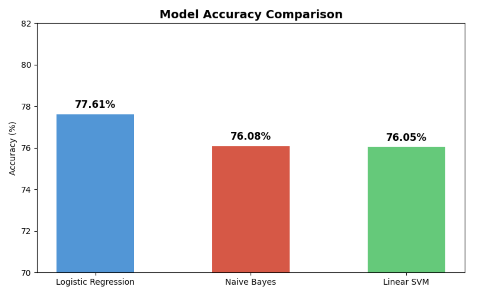
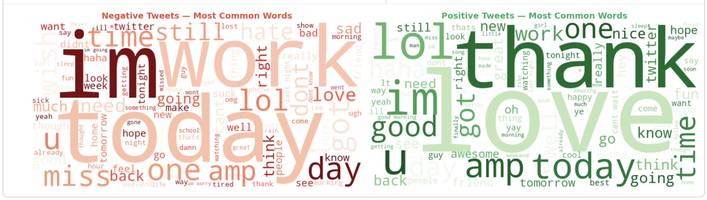

# Social Media Sentiment & Emotion Analysis

> Automatically classifies social media posts as **positive** or **negative** and detects the underlying **human emotion** — joy, sadness, anger, fear, surprise, or anticipation — using NLP and machine learning.


---

## The Problem

Social media generates millions of posts every day. Manually reading them to understand public sentiment is impossible. Businesses, researchers, and governments need a way to automatically gauge opinion at scale — whether about a product, a political event, or a public health crisis.

But sentiment alone (positive/negative) is not enough. Two people can both post negatively — one out of sadness, one out of anger. Understanding the **specific emotion** behind a post gives far deeper insight into human behaviour. This project addresses both.

---

## What This Project Does

- Classifies posts as **Positive** or **Negative** using 3 trained ML models
- Provides a **confidence score** showing how certain the model is (e.g. 94.2% Negative)
- Detects the **dominant emotion**: Joy 😊, Sadness 😢, Anger 😡, Fear 😨, Surprise 😲, Anticipation 🤩
- Includes an **interactive post analyzer** — type any text and get instant results
- Visualizes **emotion distribution** across positive vs negative posts

---

## Architecture

Raw Social Media Post
│
▼
Text Preprocessing
(Lowercase, Remove URLs/@mentions/#hashtags, Stopword Removal, Lemmatization)
│
▼
TF-IDF Feature Extraction
(50,000 features, unigrams + bigrams)
│
├──────────────────────────────────┐
▼                                  ▼
ML Sentiment Classification          Emotion Lexicon Detection
(Logistic Regression — 77.61%)       (Joy / Sadness / Anger /
(Naïve Bayes — 76.08%)               Fear / Surprise / Anticipation)
(Linear SVM — 76.05%)
│                                  │
└──────────────┬───────────────────┘
▼
Combined Analysis + Confidence Score

---

## Tech Stack

| Tool | Purpose |
|---|---|
| Python | Core programming language |
| NLTK | Text preprocessing — tokenization, stopwords, lemmatization |
| Scikit-learn | ML models + TF-IDF vectorization |
| Pandas & NumPy | Data loading and manipulation |
| Matplotlib & Seaborn | Charts and confusion matrix |
| WordCloud | Visual representation of frequent words |
| ipywidgets | Interactive post analyzer UI |
| Google Colab | Development environment |

---

## Dataset

- **Source:** [Sentiment140 — Kaggle](https://www.kaggle.com/kazanova/sentiment140)
- **Size:** 1.6 million tweets, balanced (800K positive, 800K negative)
- **Used:** 200,000 sampled posts (100K per class) for efficient training

---

## Screenshots

### Model Accuracy Comparison


### Confusion Matrix — Logistic Regression


### Word Clouds — Positive vs Negative


### Confidence Score Output


### Emotion Distribution — Positive vs Negative Posts


---

## Model Performance

| Model | Accuracy |
|---|---|
| Logistic Regression | 77.61% |
| Naïve Bayes | 76.08%|
| Linear SVM | 76.05% |

The model performs equally well on both classes with no bias — 15,239 correct negative predictions and 15,805 correct positive predictions out of 40,000 test posts.

---

## Sample Output


examples:
📝 Tweet     : I hate Mondays, so tired and bored
💬 Sentiment : 🔴 Negative
📊 Confidence: 88.0% (Very Confident)
❤️  Emotion   : 😠 ANGER

📝 Tweet     : Best day of my life, so grateful!
💬 Sentiment : 🟢 Positive
📊 Confidence: 91.8% (Very Confident)
❤️  Emotion   : 😊 JOY

📝 Tweet     : This is okay I guess
💬 Sentiment : 🟢 Positive
📊 Confidence: 57.0% (Uncertain)
❤️  Emotion   : 😶 NEUTRAL

---

## How to Run

### Option 1 — Google Colab (Recommended)
1. Open [Google Colab](https://colab.research.google.com)
2. Upload `sentiment-emotion-analysis.ipynb`
3. Upload the Sentiment140 dataset
4. Run all cells

### Option 2 — Local
```bash
git clone https://github.com/sneha020902/Social-Media-Sentiment-Analysis.git
cd Social-Media-Sentiment-Analysis
pip install pandas numpy scikit-learn nltk matplotlib seaborn wordcloud ipywidgets
jupyter notebook
```

---

## What I Learned

- How NLP preprocessing works: cleaning text, removing noise, tokenizing, lemmatizing
- The difference between TF-IDF and Count Vectorization and when to use each
- How to train, evaluate, and compare multiple ML classifiers on the same task
- How to interpret precision, recall, and F1-score beyond just accuracy
- How confidence scores (predict_proba) add nuance to binary classification
- How emotion detection bridges sentiment analysis and emotional intelligence research
- The importance of balanced datasets in classification problems

---

## Future Improvements

- [ ] Use **BERT / Transformers** for deep learning-based sentiment analysis
- [ ] Connect to the **X API** for real-time post analysis
- [ ] Build a **Flask/FastAPI** web app to demo the model live
- [ ] Expand emotion lexicon with a larger vocabulary
- [ ] Add **multi-language** support

---

## Author

**Sneha Agrawal** — Aspiring Cloud & DevOps Engineer  
🔗 [LinkedIn](https://www.linkedin.com/in/-snehaagrawal/) · [GitHub](https://github.com/sneha020902) · [Portfolio](https://sneha020902.github.io)
