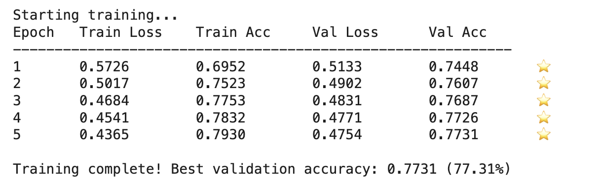
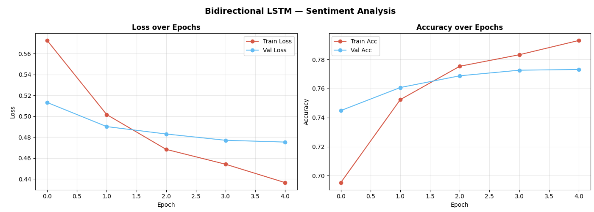
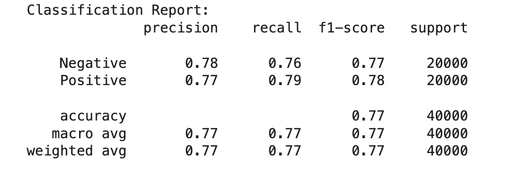
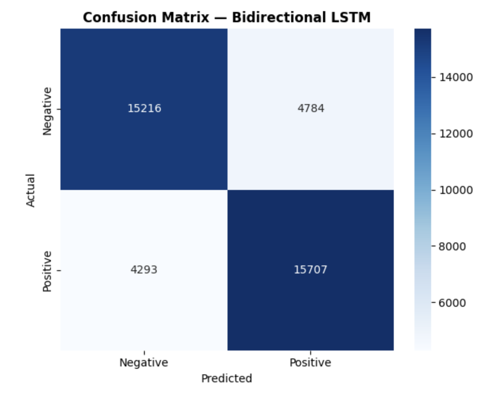
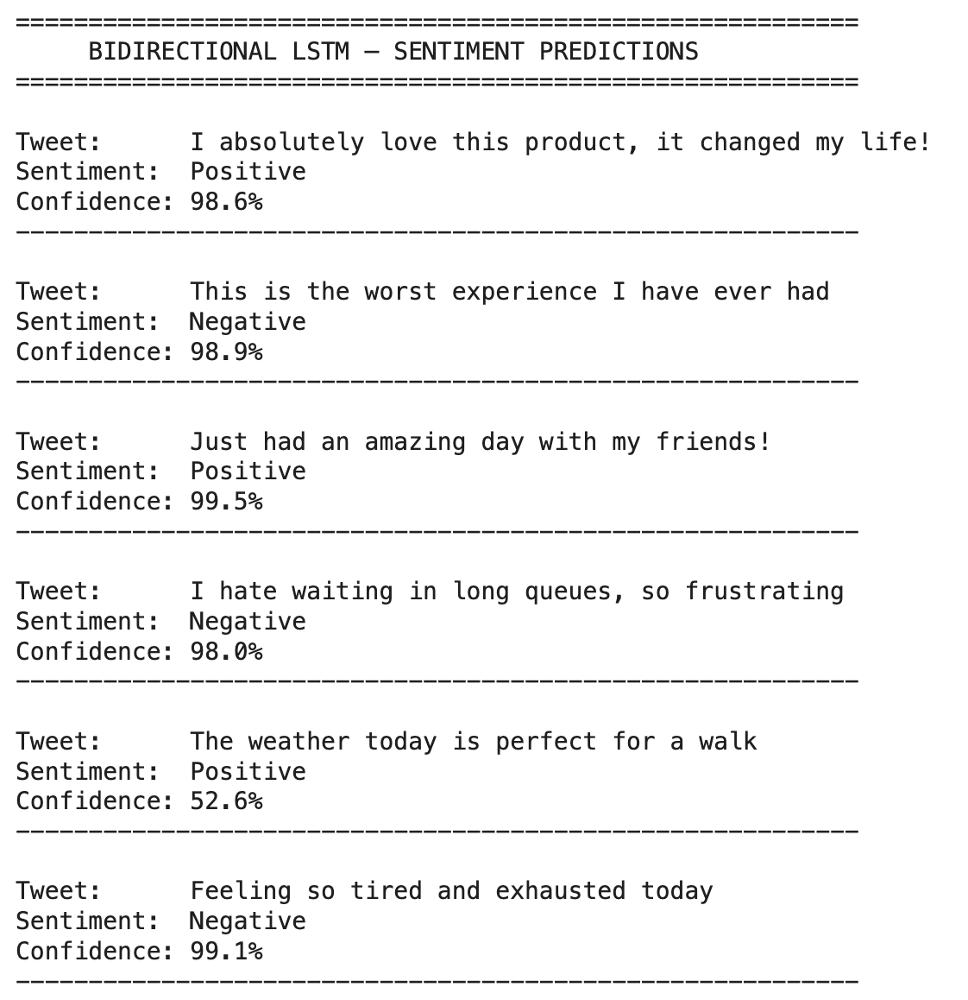

# Social Media Sentiment & Emotion Analysis

> > NLP sentiment analysis system using classical ML and PyTorch Bidirectional LSTM trained on 1.6M social media posts with GPU acceleration and emotion detection.


---

## The Problem

Social media generates millions of posts every day. Manually reading them to understand public sentiment is impossible. Businesses, researchers, and governments need a way to automatically gauge opinion at scale — whether about a product, a political event, or a public health crisis.

But sentiment alone (positive/negative) is not enough. Two people can both post negatively — one out of sadness, one out of anger. Understanding the **specific emotion** behind a post gives far deeper insight into human behaviour. This project addresses both.

---

## What This Project Does

- **Part 1 — Classical ML:** Classifies posts using 3 trained ML models with confidence scores and emotion detection
- **Part 2 — Deep Learning:** Bidirectional LSTM neural network (PyTorch) trained on GPU — 4.9M parameters, 77.3% accuracy
- Detects the **dominant emotion**: Joy 😊, Sadness 😢, Anger 😡, Fear 😨, Surprise 😲, Anticipation 🤩
- Includes an **interactive post analyzer** — type any text and get instant results
- Visualizes **emotion distribution** across positive vs negative posts

---

## Architecture

### Part 1 — Classical ML Pipeline
```
Raw Social Media Post
        │
        ▼
Text Preprocessing
├── Lowercase
├── Remove URLs, @mentions, #hashtags
├── Remove stopwords
└── Lemmatization
        │
        ▼
TF-IDF Feature Extraction
(50,000 features — unigrams + bigrams)
        │
        ├─────────────────────┐
        ▼                     ▼
ML Sentiment             Emotion Lexicon
Classification           Detection
├── Logistic Regression  ├── Joy 😊
│   (77.61%) 🏆          ├── Sadness 😢
├── Naïve Bayes          ├── Anger 😠
│   (76.08%)             ├── Fear 😨
└── Linear SVM           ├── Surprise 😲
    (76.05%)             └── Anticipation 🤩
        │                     │
        └──────────┬──────────┘
                   ▼
    Combined Analysis + Confidence Score
    (Sentiment + Emotion + Certainty %)
```

### Part 2 — Bidirectional LSTM (PyTorch)

```
Tweet Text
     │
     ▼
┌─────────────────────────────┐
│     Text Cleaning           │
│  lowercase · remove URLs    │
│  remove @mentions · #tags   │
└─────────────────────────────┘
     │
     ▼
┌─────────────────────────────┐
│  Vocabulary Lookup          │
│  20,000 most common words   │
│  <PAD> · <UNK> tokens       │
└─────────────────────────────┘
     │
     ▼
┌─────────────────────────────┐
│  Embedding Layer            │
│  20,000 × 128 dimensions    │
│  learns word meaning        │
└─────────────────────────────┘
     │
     ▼
┌─────────────────────────────┐
│  Bidirectional LSTM         │
│  256 hidden units · 2 layers│
│  ← forward + backward →    │
│  reads context both ways    │
└─────────────────────────────┘
     │
     ▼
┌─────────────────────────────┐
│  Dropout (0.3)              │
│  prevents overfitting       │
└─────────────────────────────┘
     │
     ▼
┌─────────────────────────────┐
│  Linear Layer (512 → 1)     │
│  + Sigmoid activation       │
└─────────────────────────────┘
     │
     ▼
Sentiment + Confidence %
(e.g. Positive — 98.6%)

Total Parameters: 4,928,001
Training Device:  NVIDIA T4 GPU (CUDA)
Best Val Accuracy: 77.31%
```
---

## Tech Stack

| Tool | Purpose |
|---|---|
| Python | Core programming language |
| **PyTorch** | **Bidirectional LSTM neural network — GPU training** |
| NLTK | Text preprocessing — tokenization, stopwords |
| Scikit-learn | Classical ML models + TF-IDF vectorization |
| Pandas & NumPy | Data loading and manipulation |
| Matplotlib & Seaborn | Charts, training curves, confusion matrix |
| WordCloud | Visual representation of frequent words |
| Google Colab (T4 GPU) | GPU-accelerated training environment |

---

## 📁 Dataset

- **Source:** [Sentiment140 — Kaggle](https://www.kaggle.com/kazanova/sentiment140)
- **Size:** 1.6 million tweets, balanced (800K positive, 800K negative)
- **Used:** 200,000 sampled posts (100K per class)

---

## Model Performance

### Part 1 — Classical ML
| Model | Accuracy |
|---|---|
| Logistic Regression  | 77.61% |
| Naïve Bayes | 76.08% |
| Linear SVM | 76.05% |

### Part 2 — Bidirectional LSTM (PyTorch)
| Metric | Score |
|---|---|
| Parameters | 4,928,001 |
| Best Val Accuracy | **77.31%** |
| Precision | 0.77 |
| Recall | 0.77 |
| F1-Score | 0.77 |
| Training Device | NVIDIA T4 GPU |

---

## Part 1 — Classical ML Screenshots

### Model Accuracy Comparison


### Confusion Matrix — Logistic Regression


### Word Clouds — Positive vs Negative


### Confidence Score Output


### Emotion Distribution


---

## 🧠 Part 2 — Deep Learning: Bidirectional LSTM (PyTorch)

### Training Progress


### Training Curves


### Classification Report


### Confusion Matrix — Bidirectional LSTM


### Live Predictions with Confidence Scores


---

## 💡 What I Learned

- How NLP preprocessing works: cleaning, tokenizing, lemmatizing text at scale
- The difference between TF-IDF and neural word embeddings
- How to build and train a Bidirectional LSTM from scratch using PyTorch
- How GPU-accelerated training (CUDA) speeds up deep learning significantly
- How to implement a full training loop with loss, backprop, gradient clipping
- How to interpret precision, recall, F1-score and confusion matrices
- How confidence scores (predict_proba + sigmoid) add nuance to classification
- How emotion detection bridges NLP and emotional intelligence research

---

## Future Improvements

- [x] ~~Use deep learning for sentiment analysis~~ ✅ Done — Bidirectional LSTM
- [ ] Fine-tune **BERT / RoBERTa** for further accuracy improvement
- [ ] Connect to the **X API** for real-time post analysis
- [ ] Build a **Flask/FastAPI** web app to demo the model live
- [ ] Add **multi-language** support

---

## Notebooks

| Notebook | Description |
|---|---|
| `sentiment-emotion-analysis.ipynb` | Classical ML — TF-IDF + Scikit-learn + Emotion Detection |
| `lstm-sentiment-analysis.ipynb` | Deep Learning — Bidirectional LSTM with PyTorch |

---

## How to Run

### Option 1 — Google Colab (Recommended)
1. Open [Google Colab](https://colab.research.google.com)
2. Upload the notebook you want to run
3. Upload the Sentiment140 dataset
4. Enable GPU: `Runtime → Change runtime type → T4 GPU`
5. Run all cells

### Option 2 — Local
```bash
git clone https://github.com/sneha020902/Social-Media-Sentiment-Analysis.git
cd Social-Media-Sentiment-Analysis
pip install pandas numpy scikit-learn nltk matplotlib seaborn wordcloud ipywidgets torch
jupyter notebook
```

---

## Author

**Sneha Agrawal** — Aspiring Cloud & DevOps / ML Engineer  
🔗 [LinkedIn](https://www.linkedin.com/in/-snehaagrawal/) · [GitHub](https://github.com/sneha020902) · [Portfolio](https://sneha020902.github.io)
